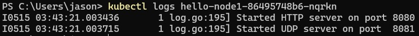
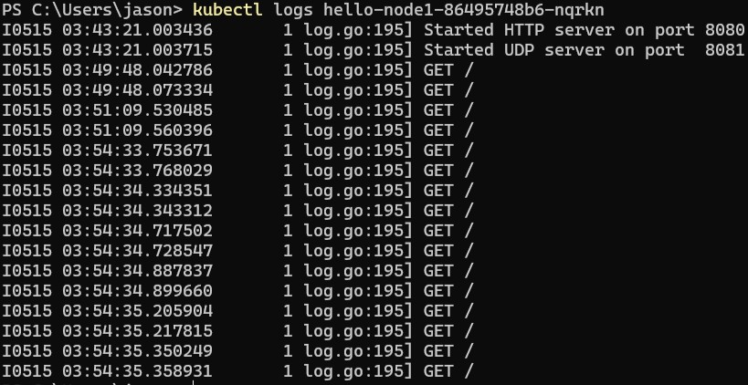

# Modul 11 Reflection

1. Compare the application logs before and after you exposed it as a Service. Try to open the app several times while the proxy into the Service is running. What do you see in the logs? Does the number of logs increase each time you open the app?

    *Before:*
     

    *After:*
     

2. Notice that there are two versions of kubectl get invocation during this tutorial section. The first does not have any option, while the latter has -n option with value set to kube-system. What is the purpose of the -n option and why did the output not list the pods/services that you explicitly created? 

    *Namespaces in Kubernetes is a mechanism for isolating specific groups of resources within a single cluster. Namespaces are created when users are separated into different teams/projects.*

    *There are two versions of `kubectl get`:*

    - *Without `-n`: means to retrieve information by default, which is from the namespace where I'm working within the Kubernetes cluster.*
    - *With `-n`: where 'n' stands for namespace, it can retrieve information based on a specific namespace only. In this tutorial, information is retrieved only from the namespace 'kube-system'.
    The output does not mention the pods/services that I've created because they are in the default namespace, not in kube-system.*

# Reflection on Rolling Update & Kubernetes Manifest File

1. What is the difference between Rolling Update and Recreate deployment strategy?
- *Rolling Update is the default deployment strategy utilized by Kubernetes. When updating a deployment, this strategy gradually replaces old pods with newer versions, ensuring no downtime. Additionally, if any issues arise during the update process, Kubernetes automatically rolls back to a more stable previous version.*

- *Recreate is a strategy where all existing pods must be terminated before newer versions are created. Consequently, there will be downtime during the update process. Typically, this strategy is employed when an application cannot run both old and new pod versions simultaneously.*

2. Try deploying the Spring Petclinic REST using Recreate deployment strategy and document your attempt.

3. Prepare different manifest files for executing Recreate deployment strategy.

4. What do you think are the benefits of using Kubernetes manifest files? Recall your experience in deploying the app manually and compare it to your experience when deploying the same app by applying the manifest files (i.e., invoking kubectl apply -f command) to the cluster.

